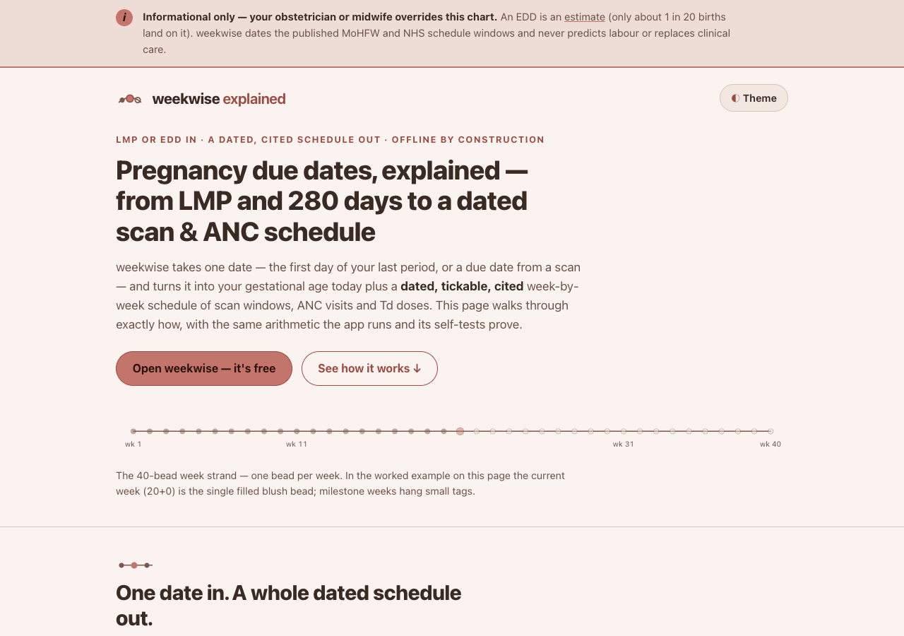

# weekwise explained — how the pregnancy due date calculator works

**An animated, single-page walkthrough of [weekwise](https://sreenivas-sadhu-prabhakara.github.io/weekwise/):
how one date — the first day of your last period, or a due date from a scan — becomes your
gestational age today and a dated, tickable, cited week-by-week schedule of scan windows,
ANC visits and Td doses, entirely in your own browser.**



- **This explainer:** https://sreenivas-sadhu-prabhakara.github.io/weekwise-explained/
- **The live app it explains:** https://sreenivas-sadhu-prabhakara.github.io/weekwise/
  ([app source](https://github.com/Sreenivas-Sadhu-Prabhakara/weekwise))

> **Informational only — not medical advice.** Your obstetrician or midwife overrides this chart.
> An EDD is an *estimate* (only about 1 in 20 births land on it). weekwise, and this explainer,
> never predict labour or replace clinical care. See the full **Disclaimer** below.

## What's on the page — five scenes

1. **The due date** — `EDD = LMP + 280 days` (the 280-day form of Naegele's rule), animated,
   and how a **dating-scan EDD overrides LMP dating**.
2. **Age today** — gestational age as weeks + days, shown as the single lit bead on the
   **40-bead week strand**, plus trimester and days to the EDD.
3. **Dated, cited windows** — how a published window (e.g. the NHS anomaly scan at 18+0–20+6
   weeks = days 126–146 from LMP) becomes *your* calendar dates, tagged upcoming / open / passed /
   done, each row cited to **MoHFW India** or **NHS England**.
4. **Tick & hand off** — ticking fills the bead solid blush; one page prints as a clean A4
   clinic sheet (your browser's print-to-PDF, no library, no upload).
5. **Private by construction** — an animated diagram of a request bouncing off
   `connect-src 'none'`: the browser itself blocks any send. It is policy, not promise.

Plus honest limits and an FAQ. Animation is pure CSS + inline SVG (no libraries — the CSP
forbids external and inline scripts beyond `app.js`). `prefers-reduced-motion` collapses every
animation to its final, fully legible state. Light and dark themes are both WCAG-AA; everything
is keyboard-operable with a skip link and visible focus rings.

## No fabricated dates

Every date the page shows is **derived at load time** by the same 280-day / day-offset
arithmetic the weekwise app uses — never hand-typed. The worked example (LMP `2026-01-05`,
EDD `2026-10-12`, "today" pinned to 20+0 weeks = `2026-05-25`) and each milestone window are
re-derived in `data/facts.js` and asserted in `test/facts.test.js`, which also
**cross-checks against the real weekwise engine** when the app repo sits beside this one.

## Quickstart

No build step, no dependencies.

```sh
git clone https://github.com/Sreenivas-Sadhu-Prabhakara/weekwise-explained.git
cd weekwise-explained
open index.html        # or serve statically: python3 -m http.server 8000
```

Run the self-tests (Node 20+):

```sh
node --test
```

The tests re-derive the due-date and gestational-age arithmetic, check leap-day handling,
re-date every example milestone window and its status, and (if `../weekwise` is present)
confirm the explainer's numbers match the app's engine exactly.

## Privacy

Same guarantee as the app it explains: this page ships a strict Content-Security-Policy with
`connect-src 'none'`, so **the browser itself blocks every network request**. No server, no
account, no analytics, no external fonts or scripts. The only thing stored is your theme
choice, in this browser's `localStorage`.

## Disclaimer

This explainer and the weekwise app are informational tools provided **"as is,"** without
warranty of any kind, and are **not medical advice**. Your obstetrician, midwife or
paediatrician overrides the chart. An estimated due date (EDD) is an *estimate*, not a
prediction — only about 4.4% of babies arrive on it (Royal Berkshire NHS Foundation Trust,
May 2026) — and these tools **never predict labour or replace clinical care**. They show a
dated snapshot of published MoHFW India and NHS England schedule windows; guidelines change,
so confirm current advice at your clinic, and no interpretation is given beyond the cited
windows. Routine singleton pregnancies only; multiple, IVF and high-risk pregnancies follow
different plans not modelled here. The hospital record / MCP card remains the record of truth.
The author accepts no liability for decisions made using these tools.

## License

[MIT](LICENSE) © 2026 Sreenivas Sadhu Prabhakara
